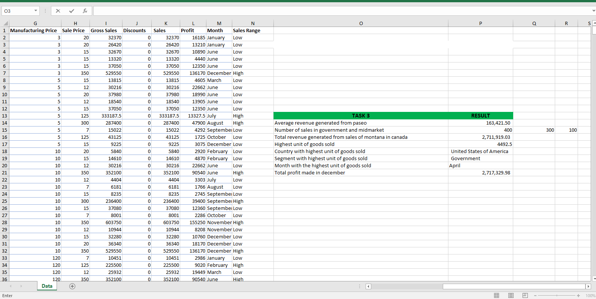

# Avanced Fuctions in Excel

## Introduction:

This report focuses on advanced functions in Microsoft Excel and the aim is to familiarize with advanced functions. In this task, a dataset was given to answer specific questions related to revenue, sales, segments, products, months, and profits.

## Skills/Concepts:

The following advanced functions were demonstrated in the task:

SUMIF
SUMIFS
COUNTIF
COUNTIFS
AVERAGEIF
AVERAGEIFS

## Problem Statement:

We are to answer the following questions based on the provided data:

Average Revenue per Sale of 'Paseo'
Sales in the Government and Mid-Market Segments
Total Revenue from Sales of 'Montana' in Canada
Highest Unit of Goods Sold
Total Profit in December

## Analysis and Results:

1. Average Revenue per Sale of 'Paseo':
Using the AVERAGEIF function, it was found that the average revenue generated from each sale of 'Paseo' is $176,295.36

2. Sales in the Government and Mid-Market Segments:
I used the COUNTIF function to determine that there were 300 sales made in the 'Government' segment and 100 sales in the 'Mid-Market' segment.

3. Total Revenue from Sales of 'Montana' in Canada:
With SUMIFS, the calculated value for the total revenue generated from the sales of 'Montana' in Canada is 2,982,114.50

4. Highest Unit of Goods Sold:
After analyzing the data, it was found that the highest unit of goods was sold in the United States of America, the Government segment, and in the Month of April. These data were determined with the use of the V-LOOKUP function.

5. Total Profit in December:
Using SumIF functions, it was calculated that the total profit made in the month of December was $2717,329.98

Below shows the screenshot of the answered questions from the dataset:

## Conclusion:
In the advanced function of Microsoft Excel, I successfully demonstrated the use of various functions to solve valuable problems from the dataset. These functions, including SUMIF, SUMIFS, COUNTIF, COUNTIFS, AVERAGEIF, and AVERAGEIFS, allowed me to answer specific questions related to revenue, sales, segments, products, sales, and profits. This task proves the power of advanced Excel functions in performing data analytics and making informed business decisions
